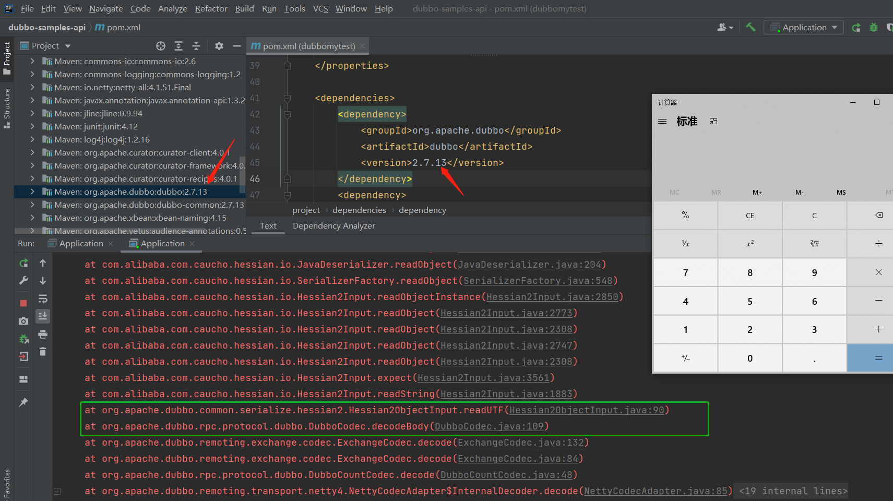

# CVE-2021-43297

## 漏洞描述

Dubbo Hessian-Lite 3.2.11及之前版本中存在潜在RCE攻击风险。Hessian-Lite在遇到序列化异常时会输出相关信息，这可能导致触发某些恶意定制的Bean的toString方法，从而引发RCE攻击。

## 原理

最开始的POC只能在Apache Dubbo<=2.7.8实现RCE，原理见[先知文章]()(审核通过后回来修改)。投稿之后又研究了一下，可以在Apache Dubbo<=2.7.13实现RCE，原理分析见[我的博客文章](https://www.cnblogs.com/bitterz/p/15828415.html)

效果如下



POC利用条件：

- apache dubbo <= 2.7.13或alibaba dubbo对应版本
- 知道dubbo provider的ip和端口，且可以访问
- dubbo provider存在ToStringBean链
- dubbo provider服务器允许向外HTTP GET请求

# 环境安装和Poc运行

- 首先下载zookeeper

```
wget http://archive.apache.org/dist/zookeeper/zookeeper-3.3.3/zookeeper-3.3.3.tar.gz
tar zxvf zookeeper-3.3.3.tar.gz
cd zookeeper-3.3.3
cp conf/zoo_sample.cfg conf/zoo.cfg
```

- 配置

```
vim conf/zoo.cfg
# The number of milliseconds of each tick
tickTime=2000
# The number of ticks that the initial
# synchronization phase can take
initLimit=10
# The number of ticks that can pass between
# sending a request and getting an acknowledgement
syncLimit=5
# the directory where the snapshot is stored.
dataDir=/绝对路径/zookeeper-3.3.3/data
# the port at which the clients will connect
clientPort=2181
```

- 修改绝对路径，在data目录下放置一个myid文件

```
mkdir data
touch data/myid
```

- 启动zookeeper

```
cd /private/var/tmp/zookeeper-3.3.3/bin
./zkServer.sh start
```

- 安装dubbo-samples-api

```
git clone https://github.com/apache/dubbo-samples.git
cd dubbo-samples/dubbo-samples-api
```

- 修改dubbo-samples/dubbo-samples-api/pom.xml

```xml
<?xml version="1.0" encoding="UTF-8"?>
<project xmlns="http://maven.apache.org/POM/4.0.0"
         xmlns:xsi="http://www.w3.org/2001/XMLSchema-instance"
         xsi:schemaLocation="http://maven.apache.org/POM/4.0.0 http://maven.apache.org/xsd/maven-4.0.0.xsd">
    <modelVersion>4.0.0</modelVersion>

    <groupId>org.example</groupId>
    <artifactId>dubbomytest</artifactId>
    <packaging>pom</packaging>
    <version>1.0-SNAPSHOT</version>
    <build>
        <plugins>
            <plugin>
                <groupId>org.apache.maven.plugins</groupId>
                <artifactId>maven-compiler-plugin</artifactId>
                <configuration>
                    <source>8</source>
                    <target>8</target>
                </configuration>
            </plugin>
        </plugins>
    </build>


    <properties>
        <source.level>1.8</source.level>
        <target.level>1.8</target.level>
        <dubbo.version>2.7.6</dubbo.version>
        <junit.version>4.12</junit.version>
        <docker-maven-plugin.version>0.30.0</docker-maven-plugin.version>
        <jib-maven-plugin.version>1.2.0</jib-maven-plugin.version>
        <maven-compiler-plugin.version>3.7.0</maven-compiler-plugin.version>
        <maven-failsafe-plugin.version>2.21.0</maven-failsafe-plugin.version>
        <image.name>${project.artifactId}:${dubbo.version}</image.name>
        <java-image.name>openjdk:8</java-image.name>
        <dubbo.port>20880</dubbo.port>
        <zookeeper.port>2181</zookeeper.port>
        <main-class>org.apache.dubbo.samples.provider.Application</main-class>
    </properties>

    <dependencies>
        <dependency>
            <groupId>org.apache.dubbo</groupId>
            <artifactId>dubbo</artifactId>
            <version>2.7.3</version>
        </dependency>
        <dependency>
            <groupId>org.apache.dubbo</groupId>
            <artifactId>dubbo-common</artifactId>
            <version>2.7.3</version>
        </dependency>

        <dependency>
            <groupId>org.apache.dubbo</groupId>
            <artifactId>dubbo-dependencies-zookeeper</artifactId>
            <version>2.7.3</version>
            <type>pom</type>
        </dependency>
        <dependency>
            <groupId>org.apache.xbean</groupId>
            <artifactId>xbean-naming</artifactId>
            <version>4.15</version>
        </dependency>
        <dependency>
            <groupId>junit</groupId>
            <artifactId>junit</artifactId>
            <version>${junit.version}</version>
            <scope>test</scope>
        </dependency>

    </dependencies>

</project>
```

- xbean包

provider端和本地都需要安装，依赖如下

```xml
<dependency>
    <groupId>org.apache.xbean</groupId>
    <artifactId>xbean-naming</artifactId>
    <version>4.15</version>
</dependency>
```

- 编译启动

IDEA中添加dubbo-samples-api，注意修改zookeeper和dubbo的端口，另外在Application.java中修改代码：

```
service.setRegistry(new RegistryConfig("zookeeper://" + zookeeperHost + ":" + zookeeperPort+"/?timeout=250000"));
```

防止高版本dubbo连接zookeeper过慢而连接失败

在idea里面启动dubbo-samples-api中的Application.java

启动后输出`dubbo service started`即表示dubbo已启动

- 运行poc
本地添加依赖：
```xml
<dependency>
   <groupId>org.apache.dubbo</groupId>
   <artifactId>dubbo-common</artifactId>
   <version>2.7.3</version>
</dependency>
<dependency>
   <groupId>org.apache.dubbo</groupId>
   <artifactId>dubbo</artifactId>
   <version>2.7.3</version>
</dependency>
<dependency>
   <groupId>org.apache.dubbo</groupId>
   <artifactId>dubbo-dependencies-zookeeper</artifactId>
   <version>2.7.3</version>
   <type>pom</type>
</dependency>
<dependency>
   <groupId>com.caucho</groupId>
   <artifactId>hessian</artifactId>
   <version>4.0.51</version>
</dependency>
```

编译ExecTest.java，随后在HttpServer.java中修改ExecTest.class的路径，然后执行HttpServer.main方法，最后执行HessianLitePoc.main方法
